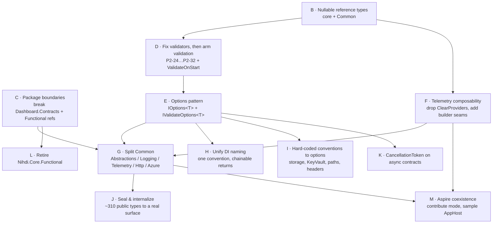

# Modernization Roadmap — Nihdi.Core.Configuration

**Report 2 of 2** · Companion: [01-Immediate-Fixes.md](01-Immediate-Fixes.md)

| | |
|---|---|
| **Subject** | `Nihdi.Core.Configuration`, current release line **4.0.0** |
| **Verified against** | HEAD `2d38c712`, which predates the 4.0.0 line — re-check each item against `main` before scheduling (see report 1's staleness note) |
| **Origin** | Independent design review of the suite against current .NET conventions |
| **Date** | 2026-08-03 |
| **Scope** | Everything that changes a public signature, a package boundary, or a runtime default. Ordered by dependency, mapped to proposed releases. |

Report 1 covers what ships without breaking anyone. This one covers the rest. Each item states **what breaks**, **what it depends on**, and **why it is worth the break** — because several of these are not worth it on their own and only pay off in combination.

The proposal is **three releases to 5.0.0**, not one. The reason is item 2 below: enabling nullable reference types changes what "required" means for roughly 30 settings properties, and doing that in the same release as the options migration makes it impossible to tell a binding regression from an annotation mistake.

---

## Release map at a glance

| Release | Theme | Breaking? | Depends on |
|---|---|---|---|
| **4.0.1** | Immediate fixes (report 1) | No | — |
| **4.1.0** | Foundations: NRT, armed validation, composability seams | Behaviour only, flagged | 4.0.1 |
| **4.2.0** | New options-based API added alongside the old; deprecation cycle opens | No (additive + `[Obsolete]`) | 4.1.0 |
| **5.0.0** | The break: remove deprecated surface, split packages, seal, unify naming | Yes, extensively | 4.2.0 |
| **5.1.0** | Aspire coexistence, optional leaf packages | No | 5.0.0 |

Two rules make this work. **Every breaking change in 5.0.0 must have shipped its replacement in 4.2.0** with an `[Obsolete]` pointing at it — so consumers migrate against a working build, one warning at a time, rather than against a compiler error wall. And **nothing lands in 5.0.0 that could have landed earlier** — a major is expensive attention, spend it only on what genuinely needs it.

---

## Dependency graph



Read it as: **B gates D gates E**, and **E gates most of the major**. C and F have no upstream dependency at all and can start on day one — which matters, because C is the cheapest high-value item on the list and F is the one that unblocks Aspire.

There is no build-and-release prerequisite: versioning is applied by the CI/CD pipeline outside the local build, so every item below can ship on the existing release machinery unchanged.

---

# 4.1.0 — Foundations

*No API signatures change. Two runtime behaviours change, both behind flags.*

### 1 · Nullable reference types across the remaining packages
**Depends on:** nothing. **Breaks:** nothing at runtime; downstream code compiling against these packages may see new warnings.

Nine of seventeen shipped projects have `<Nullable>disable</Nullable>`, including the two that matter most — `Nihdi.Core.Configuration` (the settings foundation) and `Nihdi.Core.Configuration.Common` (the largest package). `Nihdi.Core.Functional` — the package that ships `Result<T>` — is also disabled. There is no `Nullable` property in `Directory.Build.props`, which is why it drifted; one project even spells it `<Nullable>Enable</Nullable>` with a capital E. Sixteen files inside the disabled projects opt in with a file-level `#nullable enable`, so nullability is currently enabled *per feature area*.

Do this **before** the options work, not with it. Annotating `T?` on optional settings properties is how you discover what is genuinely required, and that answer is the input to the validators in item 3. Set it once in `Directory.Build.props` and fix the fallout package by package.

*This is the review's P2-25, promoted from "medium" to "first" because everything downstream depends on it.*

### 2 · Composability seams in the telemetry pipeline
**Depends on:** nothing. **Breaks:** hosts relying on `ClearProviders()` wiping their own providers — which is the bug, not the feature.

Three changes, all additive:

- Delete the unconditional `ClearProviders()` (report 1, B3).
- Add `Action<TracerProviderBuilder>` / `Action<MeterProviderBuilder>` escape hatches. Today `AddOpenTelemetry(services, config, logger)` builds the entire pipeline internally with no way for a consumer to add an `ActivitySource`, a processor, or a second exporter.
- Make the noise filter configurable. `ShouldTracePath` hard-codes eight paths and fourteen file extensions; consumers with different probe paths have no recourse.

The pattern is to compose rather than assign, so the host's own configuration survives:

```csharp
instrumentation.Filter = context =>
    (existingFilter?.Invoke(context) ?? true) && TraceNoiseFilter.ShouldTrace(context);
```

This item is what makes 5.1.0's Aspire work possible at all, and it is worth landing early regardless.

### 3 · Fix the validators, then arm validation
**Depends on:** item 1. **Breaks:** startup, for applications whose configuration is already invalid — which is the point.

Sequence strictly:

1. Fix the eleven validator bugs the July review catalogued (P2-24 through P2-32): the `ArgumentNullException` thrown from inside `BridgeConfiguration.Validate`, the no-op `TryValidateObject` calls on raw strings, `Scalar` validated under `MemberName = "Swagger"`, `HttpClientServiceConfiguration` entries validated not at all.
2. Add `Nihdi:Application:ValidateConfigurationOnStart`, **defaulting to `false`**, wired into every host template.
3. Ship. Ask teams to flip it on in DEV/TST and report what breaks.
4. Flip the default to `true` in 5.0.0.

This is the item that turns the existing validation graph — which is well-written and currently dead code outside one SUT — into a real gate, and it is what makes the P1-5 transport guard actually run. See report 1, B4 for why that guard is currently written but not armed.

### 4 · Break the two inverted package references
**Depends on:** nothing. **Breaks:** consumers importing `Nihdi.Core.Configuration.Settings.Dashboard.DashboardConfiguration` from the foundation package.

Two references invert the dependency graph:

- `Nihdi.Core.Configuration` → `Dashboard.Contracts`, because `DashboardConfiguration` moved out for WASM compatibility and left a `[TypeForwardedTo]` behind. A dashboard feature therefore sits in the dependency closure of every consumer of the base settings package.
- `Nihdi.Core.Configuration` → `Nihdi.Core.Functional`, which exists to serve **two `Preconditions.NotNull` calls** in `Common/Logging/NihdiConfigurationExtensions.cs:40-41`. Replace them with `ArgumentNullException.ThrowIfNull` and the reference disappears.

The type-forward makes the first one nearly free: move the type, keep the forward for one more release, drop the forward in 5.0.0. Do this early — item 8 (splitting `Common`) is much harder while the graph still has cycles in it.

---

# 4.2.0 — The new API, alongside the old

*Purely additive. Every new entry point ships with an `[Obsolete]` on its predecessor pointing at it. Consumers can migrate incrementally against a green build.*

### 5 · Per-feature options classes with `IValidateOptions<T>`
**Depends on:** items 1 and 3. **Breaks:** nothing yet — the old `NihdiConfiguration` graph keeps working.

This is the change you identified, and it is the spine of the whole roadmap. Today: one god-POCO bound once in `Main`, mutated during binding, hand-passed as a `(NihdiConfiguration, ILogger)` parameter into ~25 entry points, registered as a raw singleton, and mirrored into an untyped `builder.Properties` bag with accessors that throw if called in the wrong order. `IOptions<T>` appears only in the newer Blazor and Dashboard packages; three other packages read `IConfiguration` by string.

The target shape, per feature:

```csharp
public sealed class TelemetryOptions
{
    public const string SectionName = "Nihdi:OpenTelemetry";
    // …
}

services.AddOptions<TelemetryOptions>()
        .BindConfiguration(TelemetryOptions.SectionName)
        .ValidateOnStart();
```

Convert the `IValidatableObject` implementations from item 3 into `IValidateOptions<T>`. Keep both doors open — the eager pre-DI path is genuinely needed for bootstrap logging and KeyVault, which run before the container exists — but make them share one validator implementation so the rules cannot drift.

**Four problems dissolve as a side effect**, which is what makes this worth its cost rather than merely tidier: the `ILogger`-into-registration parameter (and with it the `DeferredLoggerFactory` dance every host copy-pastes), the `builder.Properties` ambient bag, the call-ordering traps, and the binding-time mutation from report 1's B1.

### 6 · One DI naming convention, chainable returns
**Depends on:** item 5 (these signatures are changing anyway — do it once). **Breaks:** every call site, at 5.0.0.

Four conventions are in use today: `AddHangfireForNihdi`, `AddNihdiWebApi`, `AddScalarNihdi`, and unmarked names like `AddCorrelation` / `AddOpenTelemetry`. Method names also encode deployment topology (`UseHangfireDashboardForNihdiCfe` / `…Bff` / `…Wfe`), and return types are inconsistent — `AddNihdiCommonServices` and `AddHangfireForNihdi` return `void`, breaking chaining.

Pick `AddNihdi<Feature>` / `UseNihdi<Feature>`, always return the receiver. Ship the new names in 4.2.0 as forwarders; `[Obsolete]` the old ones. This also retires the `AddOpenTelemetry` collision with the OpenTelemetry SDK's own extension method (report 1, B2).

### 7 · Hard-coded enterprise conventions become options
**Depends on:** item 5. **Breaks:** nothing if today's values become the defaults.

| Hard-coded | Location |
|---|---|
| `saapplic{conf}{env}001` storage account naming, `BlobContainerUri` | `Settings/ApplicationConfiguration.cs:81,109-141` — computed properties, no override hook |
| `kv-Riziv-IT-{ENV}-App-001` KeyVault name | `Common/Extensions/IHostApplicationBuilderExtensions.cs:139` |
| `\\riziv.tstdev\…` license UNC paths | `Settings/NServiceBus/NServiceBusConfiguration.cs:21-41` (public consts, with `S1075` suppressed rather than fixed) |
| `85.91.0.0/16,10.0.0.0/8,…` trusted-network fallback | `Common/Extensions/WebApplicationBuilderExtensions.cs:28` |
| `/hangfire` dashboard path | Three separate copies |
| `https://matomo.bosa.be/` | `Analytics.Matomo/MatomoConfiguration.cs:15` |
| `D:\logsint` log root | `Settings/Logging/FileConfiguration.cs` — breaks on Linux |

The rule to adopt: *every convention has an override; the enterprise value becomes the configured default, not code*. Nearly all of these are non-breaking when done that way. Two exceptions worth breaking deliberately: the trusted-network CIDR list and the CORS default (report 1, C/P2-1) should require explicit configuration rather than falling back to a permissive built-in.

### 8 · `CancellationToken` on the async contracts
**Depends on:** item 5. **Breaks:** implementers of the affected interfaces, at 5.0.0.

Roughly a third of the async surface takes no token, including `ICommandHandler<TCommand,TResult>.Execute` — which is also missing the `Async` suffix — every Dashboard view-model method, and `ServiceBusServiceClient`, which accepts a token and never forwards it. `IBackgroundRecurringTask` shows the pattern to avoid: a default-interface-method overload that accepts a token and then discards it.

Add token-accepting overloads in 4.2.0, `[Obsolete]` the tokenless ones, remove them in 5.0.0.

### 9 · Retire `Nihdi.Core.Functional`
**Depends on:** item 4. **Breaks:** the Dashboard API and consumer handler signatures, at 5.0.0.

The package is four types. `Result<T>` carries a bare `string` error and offers no `Map`/`Bind`/`Match`, so every consumer writes `if (result.IsSuccess)` — it provides the ceremony of a functional result type without the composition that justifies one. Both its constructors are `[Obsolete]` yet still public, and the factories `#pragma`-suppress their own deprecation warning to call them.

Library usage is two `Preconditions.NotNull` calls plus one public signature in `TransactionalCommandExecutor`. Real usage is concentrated in `Dashboard.Api`, where every handler is `ICommandHandler<TCommand, Result<T>>`.

Three options, in order of preference:

1. **Keep the shape, fix the type** — add `Map`/`Bind`/`Match` and a typed error (which also resolves the review's P2-20, where `MessagingEntityNotFound` maps to HTTP 500 through fragile error-*string* matching). Cheapest, no consumer break beyond the error type.
2. **Adopt an established functional library** such as LanguageExt.Core (MIT). The right answer for a greenfield project; for an existing suite with handlers already written against `Result<T>`, it buys a large dependency plus a migration in exchange for a type you barely use.
3. **Drop it** — exceptions at the boundary, no result type. Largest break.

I would take option 1 here. Reaching for an external library makes sense when you would rather not ship and maintain a functional package of your own — but this one is four small types you already own, and the gap is `Map`/`Bind`/`Match` plus a typed error, not the whole abstraction.

---

# 5.0.0 — The break

*Removals only, plus the two structural changes that cannot be done additively. Everything removed here was deprecated in 4.2.0.*

### 10 · Split `Nihdi.Core.Configuration.Common`
**Depends on:** items 4, 5, 6. **Breaks:** every consumer's package references.

`Common` carries **39 mandatory `PackageReference`s** across eight unrelated concerns — Serilog (9), OpenTelemetry (7), Azure Identity/KeyVault/DataProtection/Blobs (4), Scalar, NWebsec, the internal auth suite, `Nihdi.Core.Health`, and more. Its 56 source files span blob storage, correlation, distributed tracing, Dynatrace, health checks, hosting, HTTP clients, KeyVault, logging, and serialization. A consumer who wants only the YARP proxy still pulls all of it; a headless worker pulls Scalar and `Microsoft.AspNetCore.OpenApi`.

Target split, one package per concern:

| New package | Contents |
|---|---|
| `…Abstractions` | Correlation primitives, `IBusinessTrace`, marker interfaces — no third-party deps |
| `…Logging` | Serilog bootstrap, enrichers, `BootstrapLoggerFactory` |
| `…Telemetry` | OTel pipeline, samplers, noise filters |
| `…Http` | Typed clients, delegating handlers, liveness checks |
| `…Azure` | KeyVault, blob storage, data protection |

Do this **after** the options migration, not before. Per-feature options are what let each package own its own configuration section; splitting first means five packages all reaching into one god-POCO.

### 11 · Seal and internalize
**Depends on:** item 10 (the package split determines what genuinely needs to cross an assembly boundary). **Breaks:** anyone subclassing or referencing the affected types.

The suite is ~81% public — roughly 310 public types against 72 internal — and `internal` where it is used is immediately punched through with `InternalsVisibleTo` to four or five sibling packages. Types that are public today but are plainly implementation detail: the entire Dynatrace Serilog sink (five types), NServiceBus transport wiring, the 393-line static `BootstrapLoggerFactory`, `NamingConventionsExtensions`, `HostRunner` (a `public class` with a `protected` constructor and one static method), and sixteen unsealed public settings classes.

Every one of those is an accidental compatibility contract you are obliged to keep. Add a public-surface test so it cannot regress: one fixture asserting sealed-ness, namespace placement, and the dependency closure costs roughly 40 lines and catches the drift permanently, which matters because this is exactly the kind of discipline that erodes one merge at a time.

### 12 · Remove the deprecated surface
**Depends on:** 4.2.0 having shipped. **Breaks:** anyone who ignored the warnings.

Delete: the `(NihdiConfiguration, ILogger)` overloads, the old DI names, the tokenless async members, `GetHttpServiceClientConfig`, `TracingEnricher`, `NihdiConfiguration.Swagger` and the whole NSwag path, `AddNihdiApiServicesLegacy`, the root `TransactionalCommandExecutor`, and the eleven other `[Obsolete]` members currently carried with no removal version. Flip `ValidateConfigurationOnStart` to `true`. Convert `ValidTransportTypes` from a mutable `public struct` of strings to an `enum`.

---

# 5.1.0 — Aspire coexistence

**Depends on:** items 2 and 10. **Breaks:** nothing.

Not speculative — the first team that adopts Aspire ServiceDefaults will hit this, and today the collision is unresolvable: `ClearProviders()` destroys ServiceDefaults' logging providers, and both sides register a full OTel pipeline, producing duplicate exporters and double-counted spans.

The posture to adopt:

- **Zero `Aspire.*` references** in shipped packages. Build on the shared substrate — `Microsoft.Extensions.*`, OpenTelemetry .NET, the Azure SDK — which both stacks already depend on.
- **Owner and contribute modes** for observability. Owner (default) wires the full pipeline as today. Contribute adds only the differentiated pieces — samplers, noise filters, enrichment, business tracing — to a pipeline someone else owns, registering no exporter and leaving `service.name` alone.
- **Health checks through the stock `IHealthChecksBuilder`**, so both sides' checks land in one set.
- **Standard names**: `ConnectionStrings:` entries and well-known environment variables (`APPLICATIONINSIGHTS_CONNECTION_STRING`, `OTEL_EXPORTER_OTLP_ENDPOINT`) as first-class inputs alongside the `Nihdi:` section.

Item 2 does most of the work; this release is mainly the contribute-mode split and a sample AppHost.

---

# What I would not do

Three changes look attractive when you are already opening the packages up, and none of them earn their cost here. Each has a smaller change hiding inside it that does.

**Replacing NServiceBus with an alternative broker abstraction.** Worth it only if licensing or vendor lock-in is a live constraint — it is not: you hold licenses and run production endpoints, and the migration cost dwarfs the benefit. The part that *is* worth doing is structural and works with NServiceBus exactly as it is. `EndpointConfigurationBuilder.BuildEndpointConfiguration` is a 107-line god-method that hard-wires serializers, DLQ naming, retries, monitoring, licensing, persistence, and encryption, with `UseNServiceBusForNihdiOptions` as the only seam — and that seam leaks NServiceBus types (`RoutingSettings`, `PipelineSettings`, `IMessageConvention`) straight into your public API. Decompose the method and narrow the seam; keep the broker.

**Replacing Dynatrace with another telemetry backend.** An organizational tooling decision, not a library one, and out of scope for this roadmap. What *is* in scope: the Dynatrace sink is a bespoke Serilog implementation shipped as public API, with an unbounded in-memory queue, three dead options properties, and unescaped JSON output that malforms a batch whenever a logged value contains a quote or backslash. If Dynatrace stays — and it should, on its own merits — make that sink `internal` and fix its correctness issues (the review's P2-13 and P2-14).

**Dropping property-level message encryption.** You need it; removing it is not on the table. But the current implementation is barely testable: `EncryptionOrchestrator` branches on the static `NihdiConfiguration.IsRunningInAks()` to choose between Azure Managed HSM and the Windows certificate store, with no `IKeyProvider` abstraction between the two. That means no unit test can exercise the encryption path without a real cert store or HSM, and non-Windows development has no path at all. One interface fixes both, and it is a strictly additive change.

---

# Sequencing summary

| # | Item | Release | Depends on | Effort | Breaking |
|---|---|---|---|---|---|
| — | Report 1 items | 4.0.1 | — | S | No |
| 1 | Nullable reference types | 4.1.0 | — | M | Warnings only |
| 2 | Telemetry composability seams | 4.1.0 | — | M | Behaviour |
| 3 | Fix validators, then arm validation | 4.1.0 | 1 | M | Flagged |
| 4 | Break inverted package references | 4.1.0 | — | S | Minor |
| 5 | Options pattern | 4.2.0 | 1, 3 | **L** | No (additive) |
| 6 | Unify DI naming | 4.2.0 | 5 | M | No (additive) |
| 7 | Conventions → options | 4.2.0 | 5 | M | Mostly no |
| 8 | `CancellationToken` on contracts | 4.2.0 | 5 | S | No (additive) |
| 9 | Retire/repair `Functional` | 4.2.0 | 4 | S–M | At 5.0.0 |
| 10 | Split `Common` | 5.0.0 | 4, 5, 6 | **L** | Yes |
| 11 | Seal & internalize | 5.0.0 | 10 | M | Yes |
| 12 | Remove deprecated surface | 5.0.0 | 4.2.0 shipped | S | Yes |
| 13 | Aspire coexistence | 5.1.0 | 2, 10 | M | No |

**The two large items are 5 and 10**, and 10 depends on 5. If capacity is limited, item 5 alone delivers most of the value — it is the one that dissolves the `ILogger` parameter, the ambient property bag, the ordering traps, and the binding-time mutation in a single change.

**If you do only one thing from this report**, do item 3 — arming validation. It is the smallest change here and it activates a substantial body of correctness work that is already written and currently inert, including a P1 fix you have already shipped.
